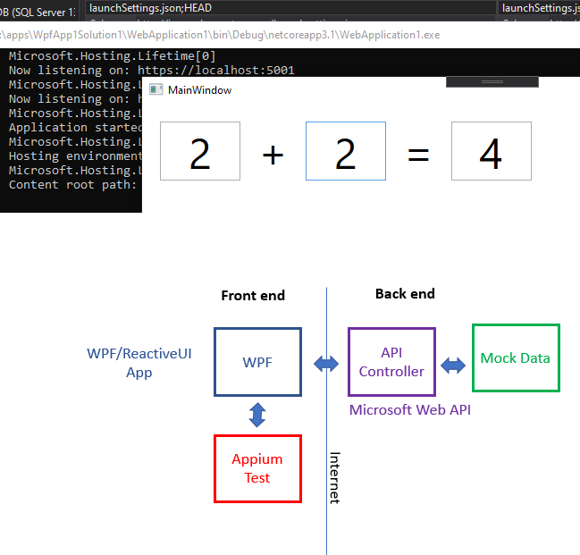

# Simple WPF and Web API solution  

9/18/20  
Web API - .Net Core 3.1  
WPF App - .Net Framework 4.8  
Unit Test Project - .Net Core 3.1  

#### Running solution:  
1. Select **Multiple startup projects** option in solution properties.  
2. Select Start option for API project  
3. Select Start option for WPF project  
4. Optional: Select Start option for ConsoleApp1 project 
5. Click Apply and start the app

#### Running Appium Test  
Prerequisites: 
1. Test machine has to be in **Developer Mode**
2. Install **WinAppDriver**
3. Visit [site](https://github.com/microsoft/WinAppDriver) for more details  

Start the API:
1. Open command line in WebApplication1 bin/Debug/netcoreapp3.1 folder
2. Type WebApplication1.exe and press enter  

Run the test:  
1. Right-click in test method and select Debug Test or Run Test

